# Unpowered Component Buildup

## Body

4:1 Ellipsoid

Exact analytical solution depicted, but it is indistinguishable from the
numerical result.

 <a href="img/MATPAN2D0.png">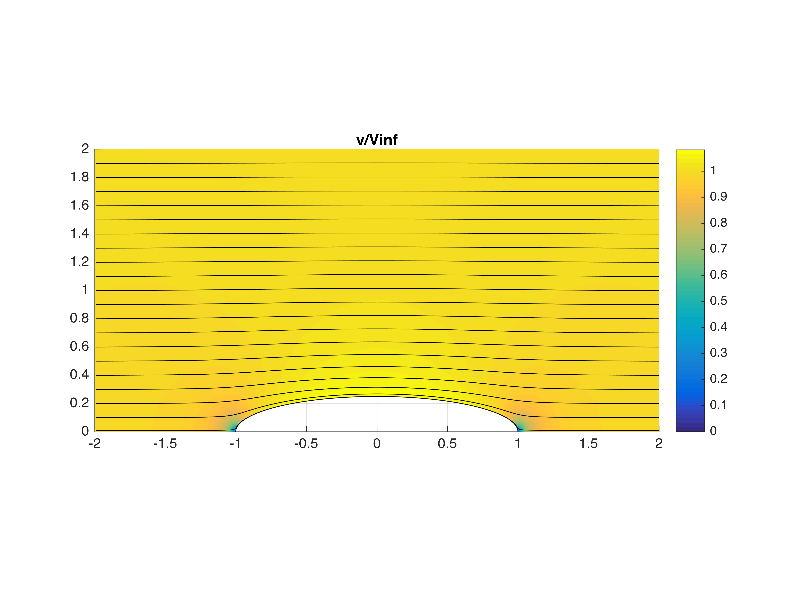</a>
 <a href="img/MATPAN2D1.png">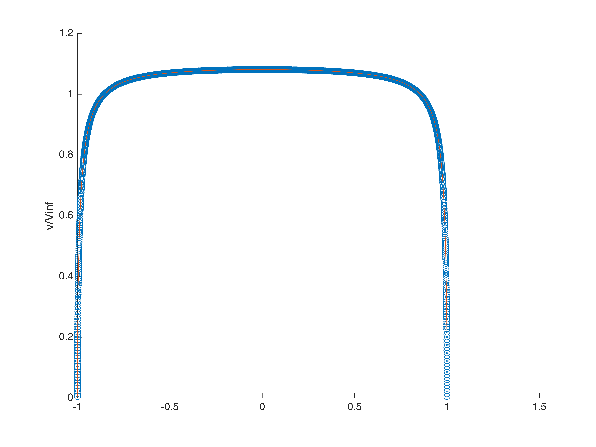</a>

 <a href="img/MATPAN2D2.png">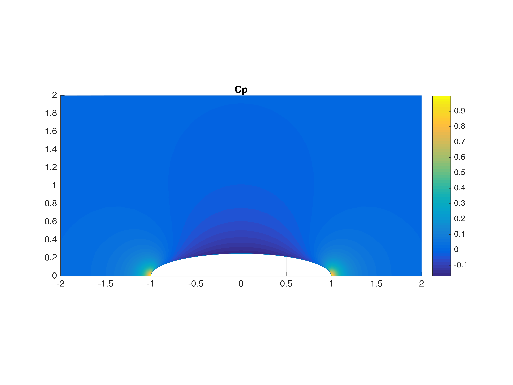</a>
 <a href="img/MATPAN2D3.png">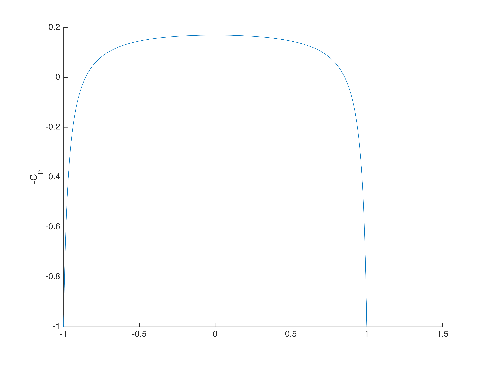</a>

## Decelerating Duct

NACA 4412 section, Chord = 0.6, LE @ (0.7, 0.4), 15$^\circ$ alpha

This case demonstrates strong circulation and substantially decelerated flow
in the duct.  Note also the deceleration before the duct.

 <a href="img/MATPAN2D4.png">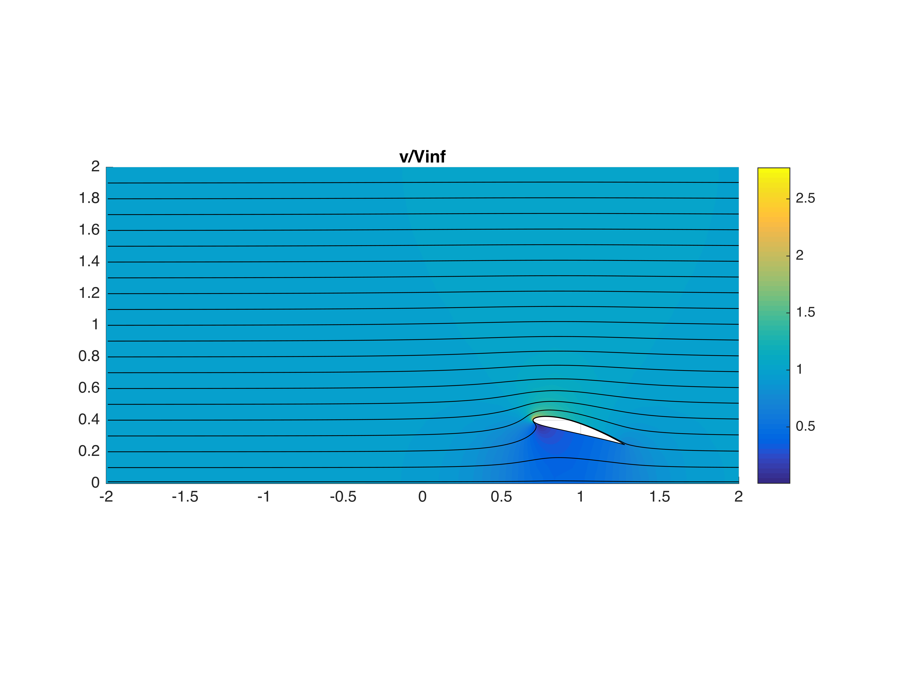</a>
 <a href="img/MATPAN2D5.png">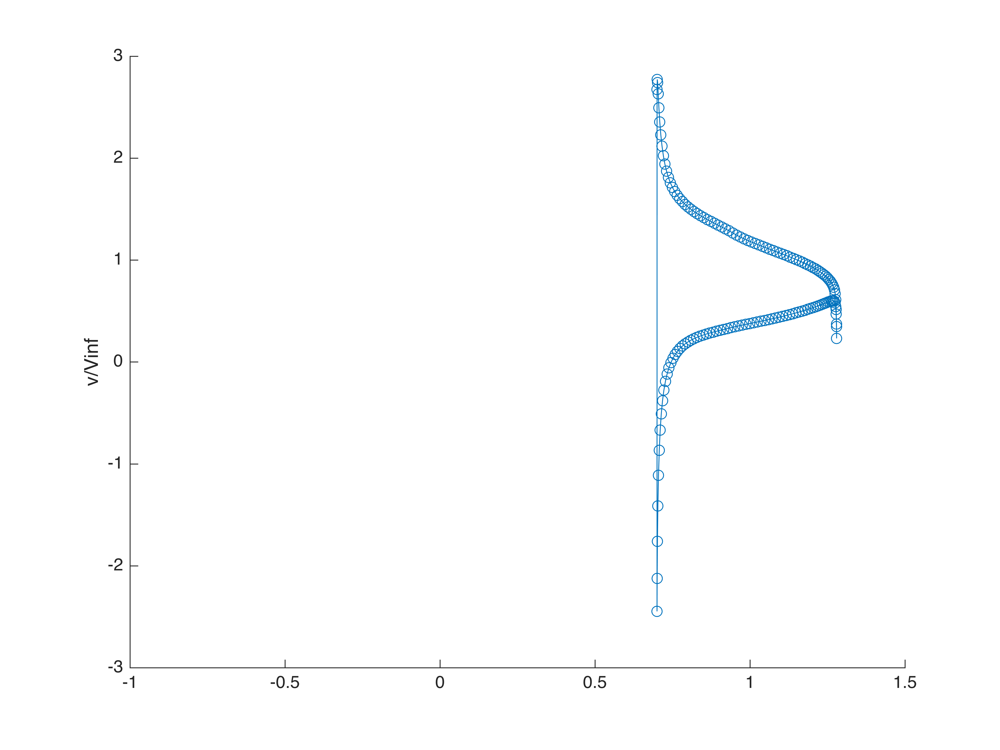</a>

 <a href="img/MATPAN2D6.png">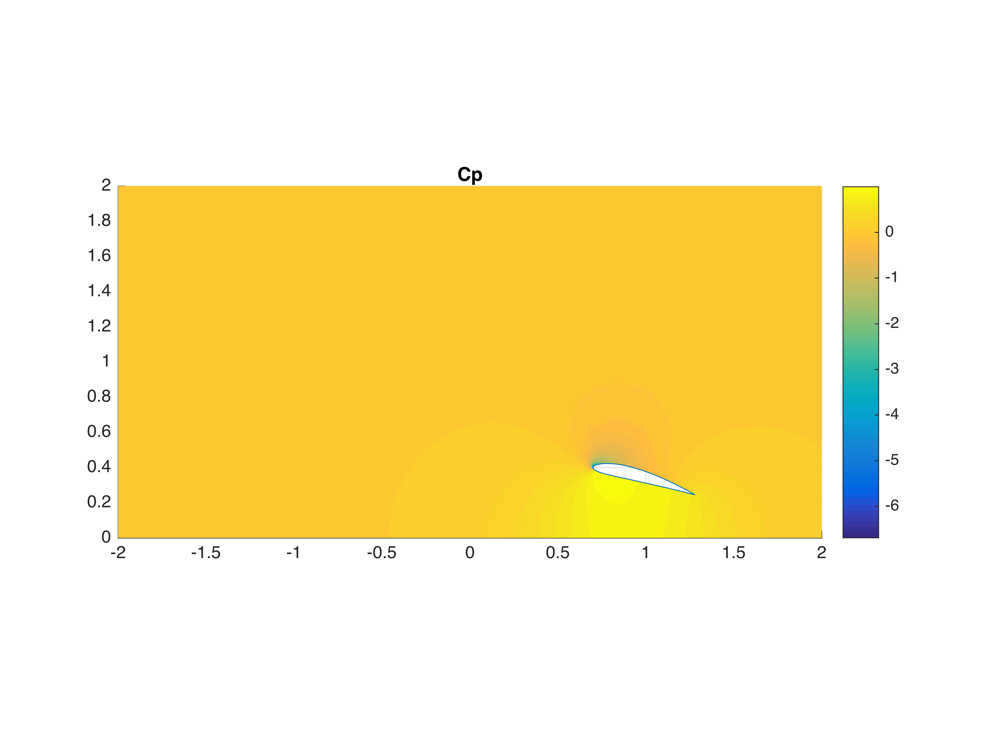</a>
 <a href="img/MATPAN2D7.png">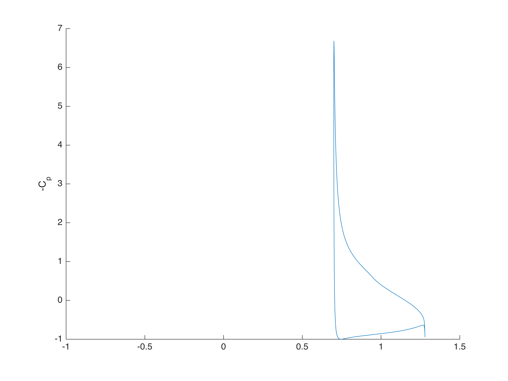</a>

## Combined Body & Duct

Notice the duct has a strong effect on the aft end of the body, but little
effect on the fore end.  The analytical solution for the isolated ellipse is still
shown.  The influence of the duct is limited to about one chord ahead of the leading edge.

 <a href="img/MATPAN2D12.png">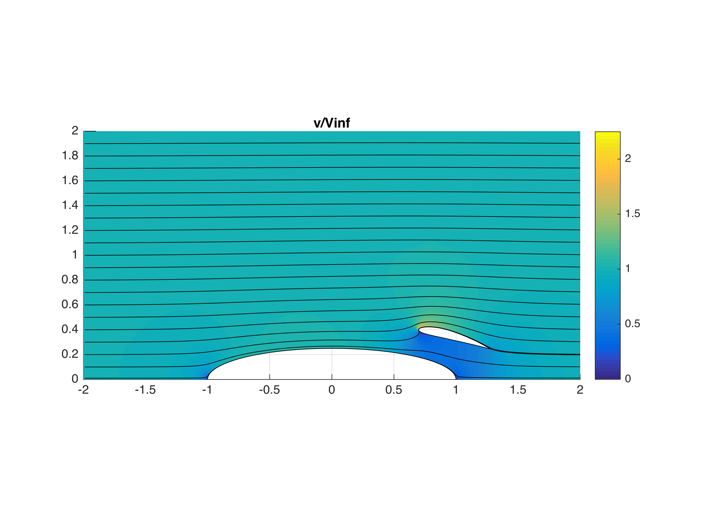</a>
 <a href="img/MATPAN2D13.png">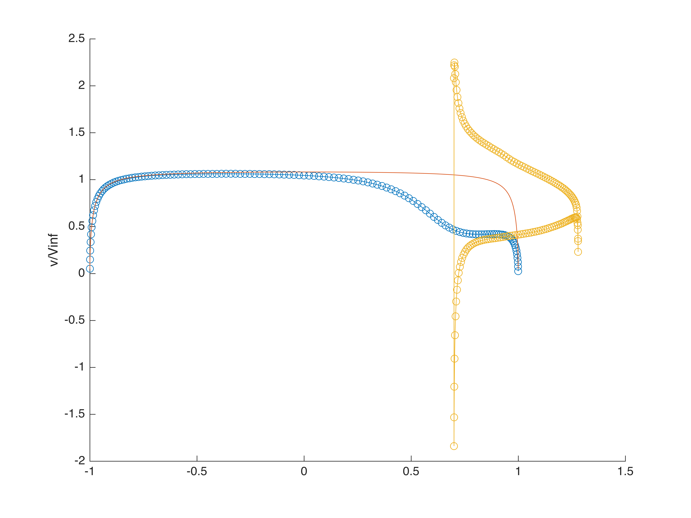</a>

 <a href="img/MATPAN2D14.png">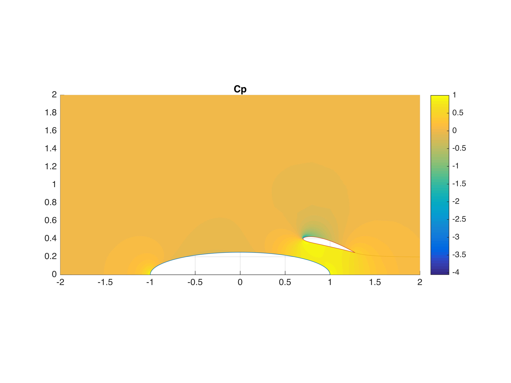</a>
 <a href="img/MATPAN2D15.png">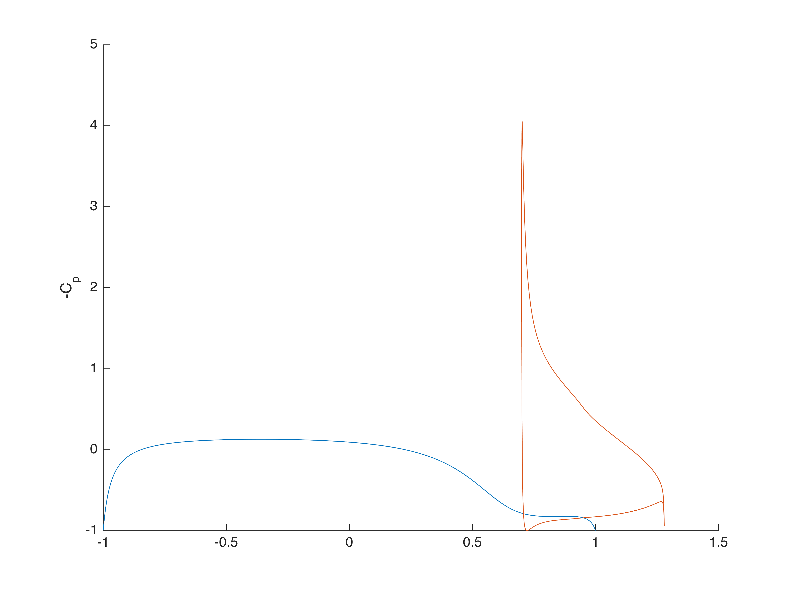</a>

