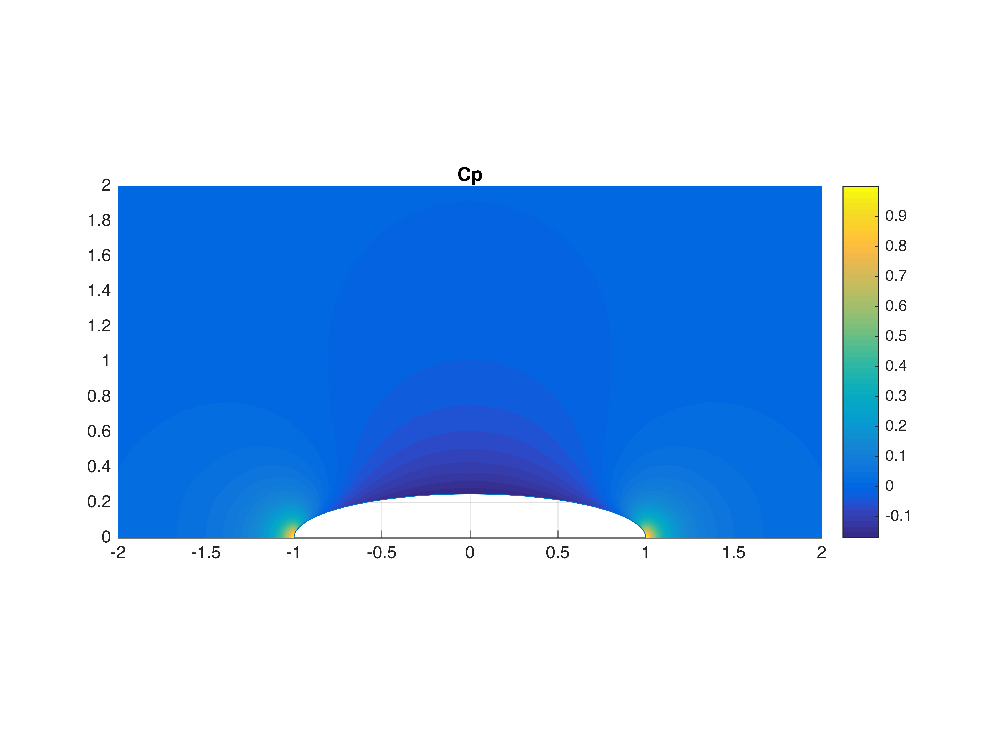

# Powered Body Alone Buildup

## Unpowered Body

4:1 Ellipsoid

Exact analytical solution depicted, but it is indistinguishable from the
numerical result.

 
 

 
 

## Body & Lightly Loaded Disk

$\Delta C_P =$ 0.75 @X = 0.85

Disk causes modest acceleration on aft end of body.

 
 

 
 

## Body & Heavily Loaded Disk

$\Delta C_P =$ 5.0 @X = 0.85

Disk causes strong acceleration on aft end of body, extending to mid body.

 
 

 
 

