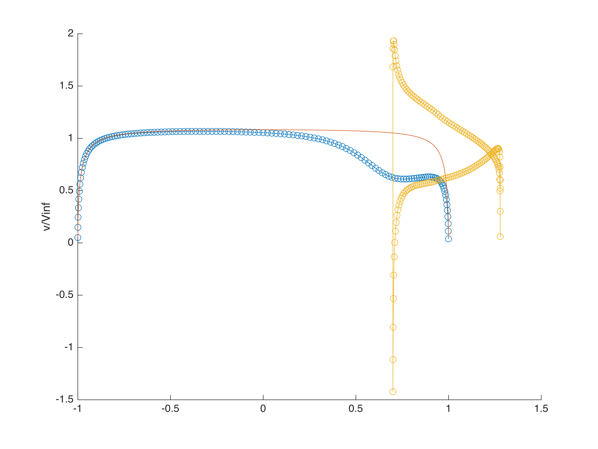
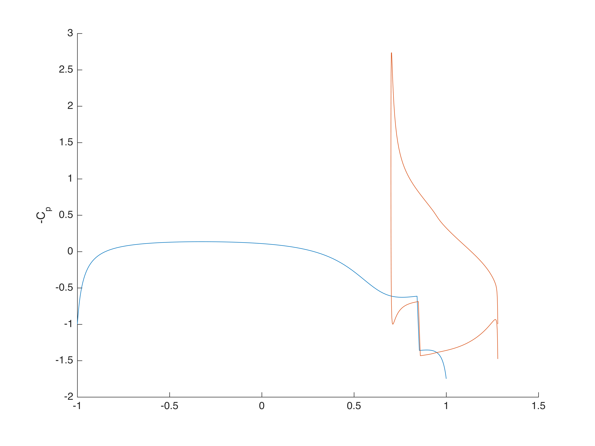
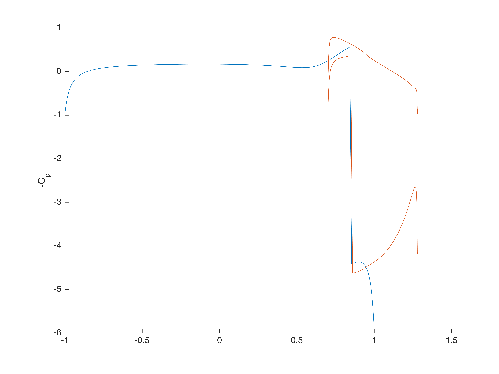
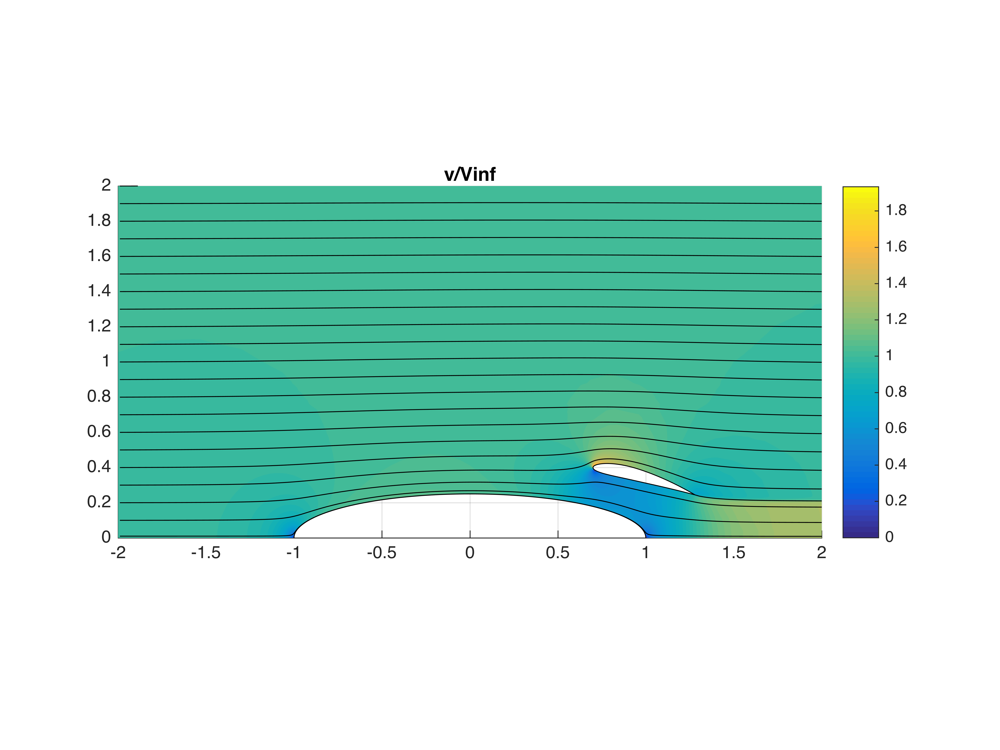
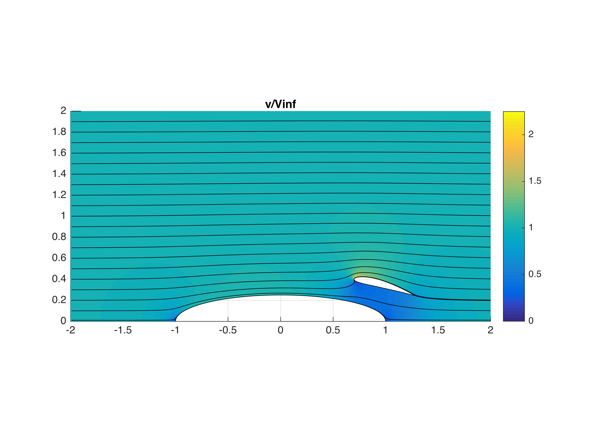
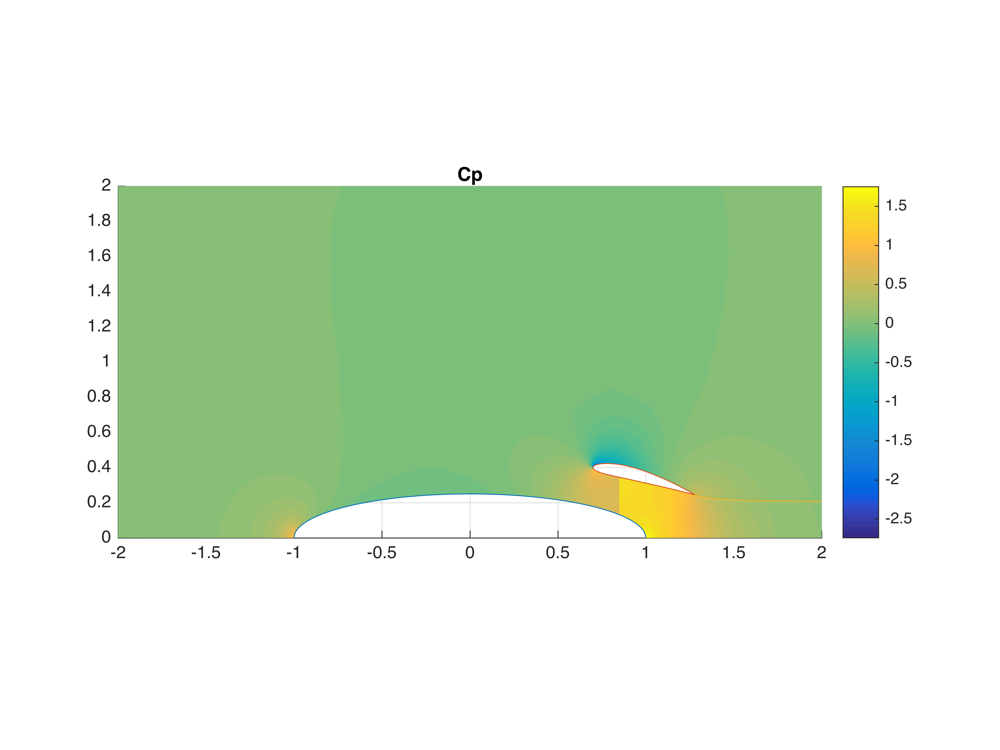
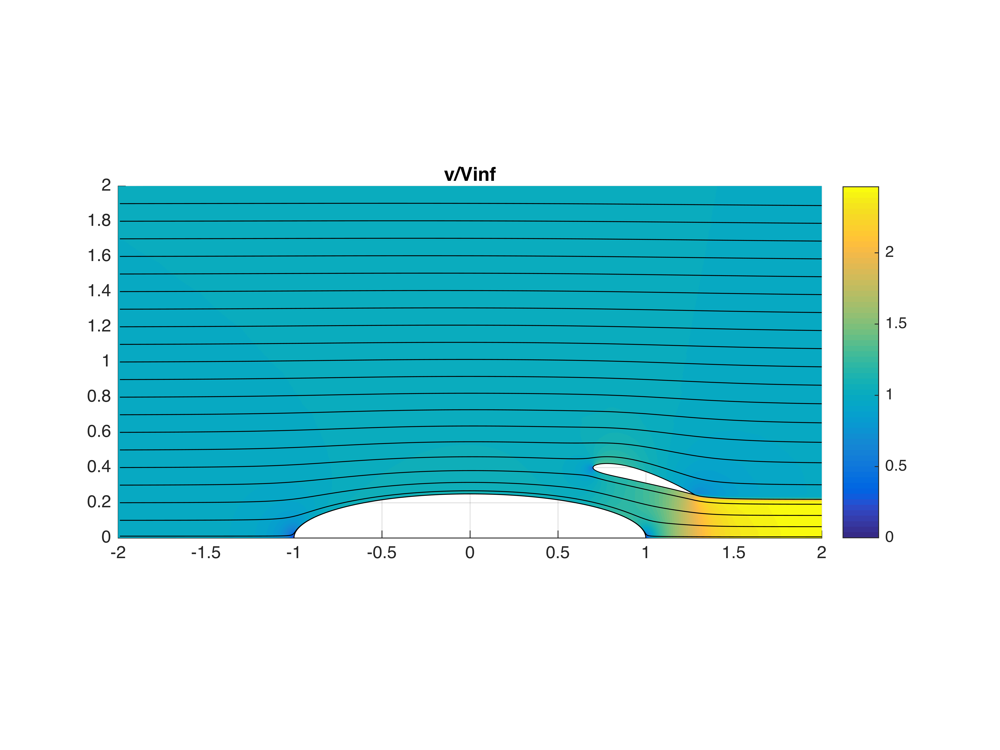
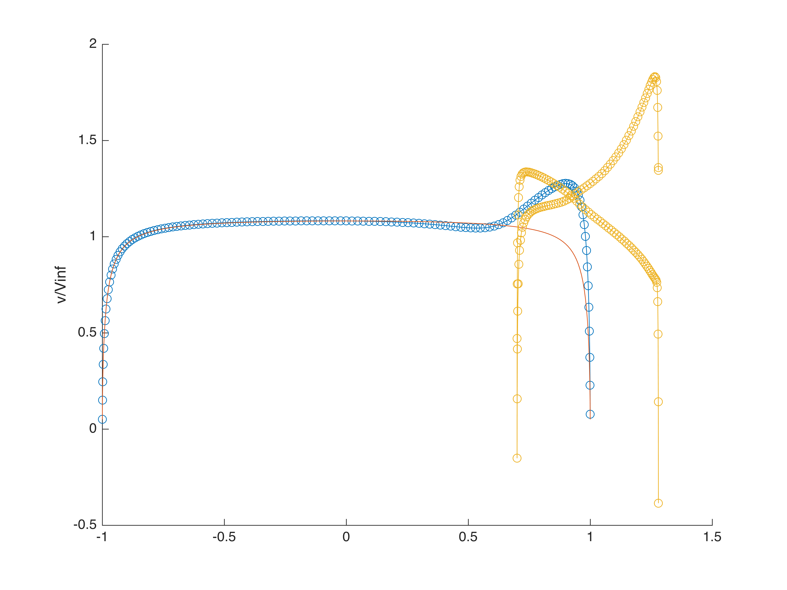
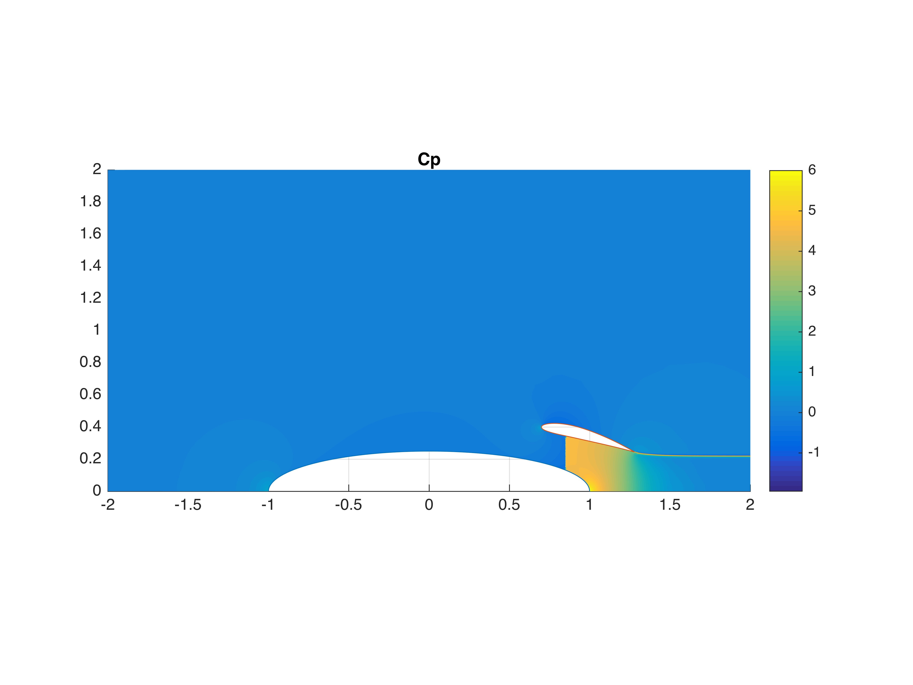

# Powered Configuration

## Propulsive Effect

Addition of actuator disk increases velocity in duct.
Exact isolated ellipsoid solution included for reference.

| Unpowered | Lightly Loaded Disk   $\Delta C_P =$ 0.75   @X = 0.85 | Heavily Loaded Disk   $\Delta C_P =$ 5.0   @X = 0.85 |
| --- | --- | --- |
|  |  |  |
|  |  |  |

## Body & Lightly Loaded Disk

$\Delta C_P =$ 0.75 @X = 0.85

Disk and duct cause strong effect on aft end of body, with little effect on
forebody.

 
 

 
 

## Body, Duct & Heavily Loaded Disk

$\Delta C_P =$ 5.0 @X = 0.85

Disk and duct cause strong effect on aft end of body, with little effect on
forebody.

 
 

 
 

