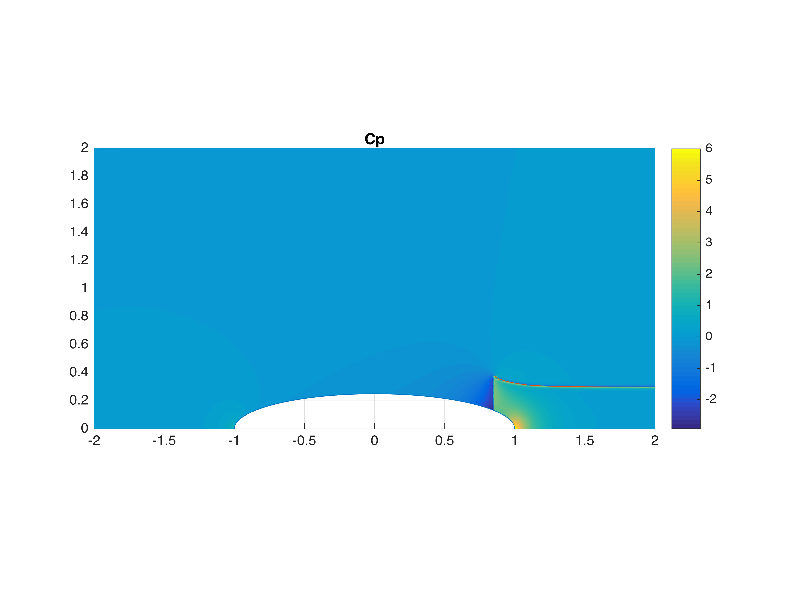
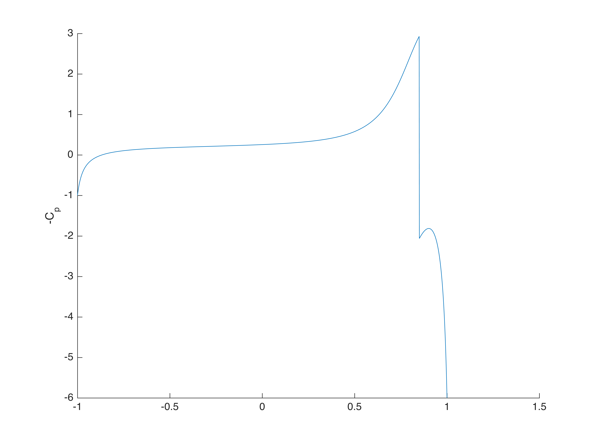
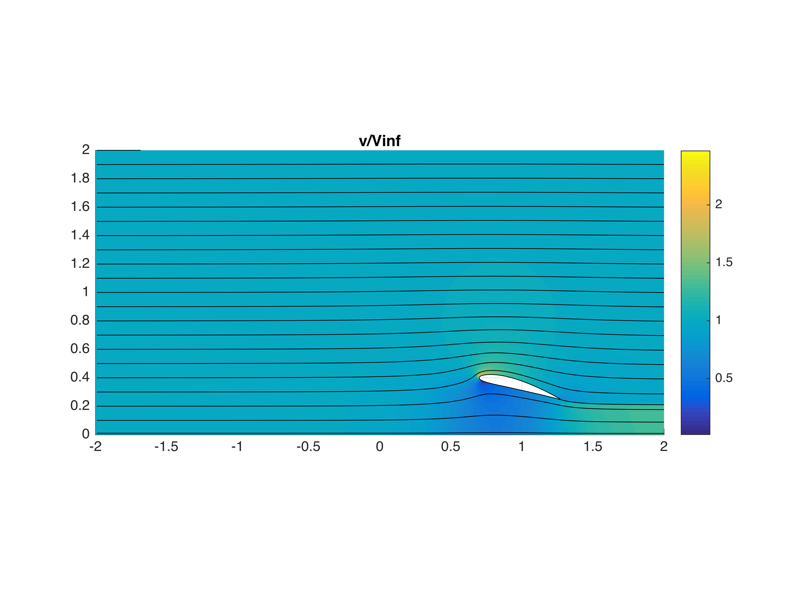

# Powered Duct Alone Buildup

## Decelerating Duct

NACA 4412 section, Chord = 0.6, LE @ (0.7, 0.4), 15$^\circ$ alpha

This case demonstrates strong circulation and substantially decelerated flow
in the duct.  Note also the deceleration before the duct.

 
 

 
 

## Duct & Lightly Loaded Disk

$\Delta C_P =$ 0.75 @X = 0.85

Disk causes increase in velocity inside the duct, mimimal effect on outer surface.

 
 

 
 

## Body & Heavily Loaded Disk

$\Delta C_P =$ 5.0 @X = 0.85

Disk causes significantly increased velocity inside the duct and increased mass capture.
Nearly full mass capture is achieved, with little deceleration ahead of the duct.

 
 

 
 

